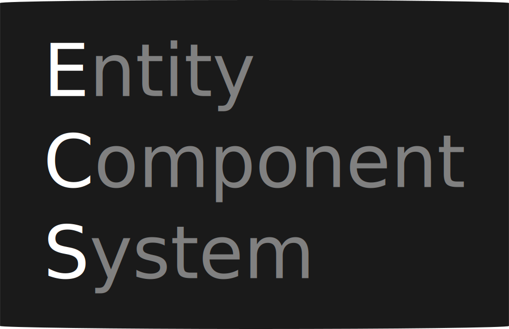

<p align="center" style="width:"> 
 
 </p>

 **Odin ECS** was built because I needed a way to dynamically add functionality to things in my game. I also just find entity component systems fun to work with and I couldn't find a general purpose one for Odin , so I made it myself.


 **Features**:
 - Any type can be a Component
 - Unlimited* Amount of Component Types


Example Usage:
```cpp
package main

import ecs "odin-ecs"
import "core:fmt"

// Context: Internal state that the ECS needs to manipulate.
ctx: ecs.Context

// You can add any type as a Component!
Name :: distinct string

main :: proc() {

  ctx = ecs.init_ecs()
  defer ecs.deinit_ecs(&ctx)

  player := ecs.create_entity(&ctx)
 
  // (Optional) Or you can let ecs.deinit_ecs()... clean this up.
  defer ecs.destroy_entity(&ctx, player)

  name_component, err := ecs.add_component(&ctx, player, Name("Yuki"))
  fmt.println(name_component^) // "Yuki"
 
  remove_err := ecs.remove_component(&ctx, player, Name)
  //(Optional) Or you can let ecs.destroy_entity()... clean this up.
}

```
